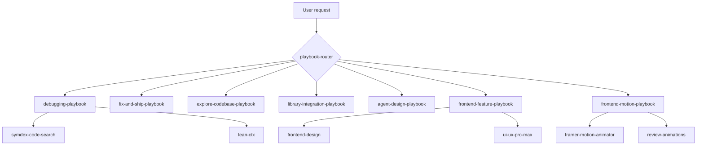

<p align="center">
  
  
  
</p>

<h1 align="center">Agent Skill Routers</h1>

<p align="center">
  <strong>Stop drowning your agent in 50 skills.</strong><br />
  Thin playbooks that route to the right workflow — and to <strong>famous skills.sh skills</strong><br />
  (Vercel, Anthropic, Obra Superpowers, Matt Pocock, Supabase, Playwright, and more).
</p>

<p align="center">
  <a href="INSTALL.md">Install guide</a> ·
  <a href="#slash-menu">Slash menu</a> ·
  <a href="#famous-skills">Famous skills</a> ·
  <a href="#playbooks">Playbooks</a> ·
  <a href="#frontend-stack">Frontend</a> ·
  <a href="#how-it-works">How it works</a> ·
  <a href="docs/architecture.md">Architecture</a>
</p>

---

## The problem

You installed caveman, SymDex, lean-ctx, context engineering, Context7, frontend-design, Framer Motion skills… and now the agent:

- Picks the **wrong** skill for the task
- **Reads whole files** when SymDex + lean-ctx would suffice
- Produces **generic UI** because design skills never loaded in the right order
- **Stacks** context-engineering theory on a simple null-pointer fix

**Skill routers fix routing, not intelligence.** Each playbook is ~80 lines. Child skills stay separate.

## Quick install

See **[INSTALL.md](INSTALL.md)** for Windows PowerShell, macOS, Linux, and per-agent steps.

```bash
npx skills add TeckTinkerere/agent-skill-routers -g --all -y --copy
```

Restart your agent after install.

## Slash menu (hover descriptions)

When you type `/` in Cursor (or use the skill picker in Claude Code, Codex, etc.), each skill shows a **hover tooltip**. That text is the `description` field in each `skills/*/SKILL.md` frontmatter — **we control it**.

Format we use: **what it does** + `Use when:` + **plain trigger phrases**.

| Skill | Hover text (what you see) |
|-------|---------------------------|
| `playbook-router` | Pick the right workflow when the task is unclear |
| `planning-playbook` | Plan before coding: brainstorm, PRD, stress-test ideas |
| `debugging-playbook` | Find and fix bugs step by step |
| `fix-and-ship-playbook` | Make a small fix, verify, commit or PR |
| `testing-playbook` | Write and run tests (TDD, Playwright) |
| `code-review-playbook` | Review a PR or diff |
| `refactor-playbook` | Improve structure without changing behavior |
| `deploy-playbook` | Deploy to Vercel or preview |
| `database-playbook` | SQL, Postgres, Supabase |
| `e2e-qa-playbook` | Test in a real browser |
| `security-review-playbook` | Security pass on code and rules |
| `explore-codebase-playbook` | Explain how the codebase works |
| `library-integration-playbook` | Integrate a library with current docs |
| `agent-design-playbook` | Design agent systems and context |
| `frontend-feature-playbook` | Build or redesign UI |
| `frontend-motion-playbook` | Add animations and motion |
| `playbook-common` | Skill install list for missing dependencies |

To change hover text: edit `description` in the skill's `SKILL.md`, push, then run `npx skills update -g`.

---

## Quick install (one-liner)

Install recommended child skills — full curated bundle in the catalog, or the **famous skills starter pack**:

```bash
# See skills/playbook-common/references/skill-catalog.md for the full one-shot bundle
npx skills add vercel-labs/agent-browser anthropics/skills@webapp-testing obra/superpowers -g --all -y --copy
npx skills add vercel-labs/agent-skills supabase/agent-skills mattpocock/skills -g --all -y --copy
```

Legacy minimal bundle:

```bash
# Code intelligence
npx skills add husnainpk/SymDex yvgude/lean-ctx JuliusBrussee/caveman upstash/context7 -g --all -y --copy

# Frontend design + motion
npx skills add anthropics/skills@frontend-design \
  nextlevelbuilder/ui-ux-pro-max-skill \
  patricio0312rev/skills@framer-motion-animator \
  emilkowalski/skills@review-animations \
  lottiefiles/motion-design-skill \
  shadcn/ui@shadcn \
  wshobson/agents@tailwind-design-system \
  -g -y --copy
```

Restart your agent after install.

## Playbooks

### Core workflows

| Playbook | Say this… | Routes to (top skills) |
|----------|-----------|------------------------|
| [`playbook-router`](skills/playbook-router/) | unclear task | Picks one playbook |
| [`planning-playbook`](skills/planning-playbook/) | plan, PRD, grill idea | `brainstorming`, `grill-me`, `to-prd` |
| [`debugging-playbook`](skills/debugging-playbook/) | debug, error, root cause | `systematic-debugging`, SymDex, lean-ctx |
| [`fix-and-ship-playbook`](skills/fix-and-ship-playbook/) | fix, commit, PR | TDD, `caveman-commit`, code review |
| [`testing-playbook`](skills/testing-playbook/) | tests, TDD, Playwright | `test-driven-development`, `webapp-testing` |
| [`code-review-playbook`](skills/code-review-playbook/) | review PR, diff | `requesting-code-review`, `vercel-react-best-practices` |
| [`refactor-playbook`](skills/refactor-playbook/) | refactor, tech debt | `improve-codebase-architecture`, composition patterns |
| [`deploy-playbook`](skills/deploy-playbook/) | deploy, Vercel, go live | `deploy-to-vercel`, `vercel-optimize` |
| [`database-playbook`](skills/database-playbook/) | SQL, Supabase, migrations | `supabase-postgres-best-practices` |
| [`e2e-qa-playbook`](skills/e2e-qa-playbook/) | browser QA, smoke test | `agent-browser` (499K+ installs) |
| [`security-review-playbook`](skills/security-review-playbook/) | security audit | `semgrep`, Firebase rules auditors |
| [`explore-codebase-playbook`](skills/explore-codebase-playbook/) | how does X work | SymDex → lean-ctx |
| [`library-integration-playbook`](skills/library-integration-playbook/) | library API docs | Context7 → repo patterns |
| [`agent-design-playbook`](skills/agent-design-playbook/) | multi-agent, harness | Context engineering collection |
| [`frontend-feature-playbook`](skills/frontend-feature-playbook/) | build UI, landing | `frontend-design`, `web-design-guidelines` |
| [`frontend-motion-playbook`](skills/frontend-motion-playbook/) | animate, Framer Motion | `framer-motion-animator`, `review-animations` |

Full dependency list with install counts: [`skills/playbook-common/references/skill-catalog.md`](skills/playbook-common/references/skill-catalog.md)

## Famous skills (skills.sh leaderboard)

Routers wire into the most-installed ecosystem skills — vendor-first, battle-tested:

| Skill | Publisher | Installs | Routed by |
|-------|-----------|----------|-----------|
| `find-skills` | vercel-labs | 2.3M+ | planning |
| `frontend-design` | anthropics | 610K+ | frontend-feature |
| `vercel-react-best-practices` | vercel-labs | 515K+ | frontend, code-review, refactor |
| `agent-browser` | vercel-labs | 499K+ | e2e-qa |
| `web-design-guidelines` | vercel-labs | 428K+ | frontend-feature |
| `grill-me` | mattpocock | 425K+ | planning |
| `remotion-best-practices` | remotion-dev | 401K+ | frontend-motion (video) |
| `tdd` | mattpocock | 330K+ | testing |
| `systematic-debugging` | obra | 166K+ | debugging |
| `requesting-code-review` | obra | 149K+ | code-review |
| `supabase-postgres-best-practices` | supabase | 260K+ | database |
| `webapp-testing` | anthropics | 107K+ | testing, e2e-qa |
| `deploy-to-vercel` | vercel-labs | 82K+ | deploy |
| `playwright-cli` | microsoft | 72K+ | testing, e2e-qa |

Data from [skills.sh](https://skills.sh) leaderboard (2026). Install counts are telemetry-based, not quality guarantees — prefer vendor skills.

## How it works



1. Agent matches a **situation** from the playbook `description` (YAML frontmatter).
2. Playbook lists **child skills to read** in order — not copy-paste.
3. Missing skill? Catalog has `npx skills add …` one-liners.
4. Playbook says what to **skip** (e.g. no caveman when teaching architecture).

## Frontend stack

Two playbooks split UI work so design and motion don't fight each other.

### Feature build (`frontend-feature-playbook`)

| Child skill | Source | Role |
|-------------|--------|------|
| `frontend-design` | [anthropics/skills](https://skills.sh/anthropics/skills/frontend-design) | Distinctive visual direction (610K+) |
| `web-design-guidelines` | [vercel-labs/agent-skills](https://skills.sh/vercel-labs/agent-skills/web-design-guidelines) | Vercel UI/a11y bar (428K+) |
| `vercel-react-best-practices` | [vercel-labs/agent-skills](https://skills.sh/vercel-labs/agent-skills/vercel-react-best-practices) | React/Next perf (515K+) |
| `ui-ux-pro-max` | [nextlevelbuilder](https://skills.sh/nextlevelbuilder/ui-ux-pro-max-skill/ui-ux-pro-max) | UX + accessibility patterns |
| `tailwind-design-system` | [wshobson/agents](https://skills.sh/wshobson/agents/tailwind-design-system) | Token scale, responsive layout |
| `shadcn` | [shadcn/ui](https://skills.sh/shadcn/ui/shadcn) | Component primitives |

### Motion polish (`frontend-motion-playbook`)

| Child skill | Source | Role |
|-------------|--------|------|
| `framer-motion-animator` | [patricio0312rev/skills](https://skills.sh/patricio0312rev/skills/framer-motion-animator) | React + Motion.dev / Framer Motion |
| `review-animations` | [emilkowalski/skills](https://skills.sh/emilkowalski/skills/review-animations) | Pre-ship motion critique |
| `motion-design` | [lottiefiles](https://skills.sh/lottiefiles/motion-design-skill/motion-design) | Animation principles |
| `ui-animation` | [mblode/agent-skills](https://skills.sh/mblode/agent-skills/ui-animation) | CSS / cross-framework motion |

> **Motion.dev** users: `framer-motion-animator` covers `motion` components, layout, scroll, and `useReducedMotion`. Always pair with `review-animations` before shipping.

## Example sessions

**Debug a failing API route**

```
User: "POST /api/checkout returns 500 after deploy"
→ debugging-playbook
→ symdex: find route handler + callers
→ lean-ctx: read handler signatures + error branch lines only
```

**Build a landing page**

```
User: "Create a pricing page for our devtools product"
→ frontend-feature-playbook
→ frontend-design: token system + signature element
→ shadcn + tailwind: implement
→ frontend-motion-playbook: hero stagger + scroll reveal
→ review-animations: timing pass
```

**Integrate Framer Motion in existing app**

```
User: "Add page transitions with Framer Motion"
→ library-integration-playbook (Context7 for current API)
→ frontend-motion-playbook (implementation + reduced motion)
```

## Compatible agents

Installs via [skills.sh](https://skills.sh) to **70+ agents**, including:

Cursor · Claude Code · Codex · Kiro · OpenCode · Windsurf · Copilot · Gemini CLI · Cline · Roo · Continue · and more.

Open Plugins manifest: [`.plugin/plugin.json`](.plugin/plugin.json)

## Repository layout

```
agent-skill-routers/
├── skills/
│   ├── playbook-router/          # Meta: pick a situation
│   ├── playbook-common/          # Skill catalog + resolution rules
│   ├── debugging-playbook/
│   ├── fix-and-ship-playbook/
│   ├── planning-playbook/
│   ├── testing-playbook/
│   ├── code-review-playbook/
│   ├── refactor-playbook/
│   ├── deploy-playbook/
│   ├── database-playbook/
│   ├── e2e-qa-playbook/
│   ├── security-review-playbook/
│   ├── explore-codebase-playbook/
│   ├── library-integration-playbook/
│   ├── agent-design-playbook/
│   ├── frontend-feature-playbook/
│   └── frontend-motion-playbook/
├── docs/architecture.md
└── README.md
```

## Contributing

1. Fork the repo
2. Add or edit a playbook under `skills/`
3. Update `skill-catalog.md` and `playbook-router` decision tree
4. Open a PR

Playbooks should stay **under 150 lines**. No megaskills.

## Author

**[TeckTinkerere](https://github.com/TeckTinkerere)**

Built for developers running multiple AI agents with large skill libraries who want **situation-aware routing** without maintaining a monolithic prompt.

## License

MIT — see [LICENSE](LICENSE).

---

<p align="center">
  <sub>If this saves you context window sanity, star the repo ⭐</sub>
</p>
