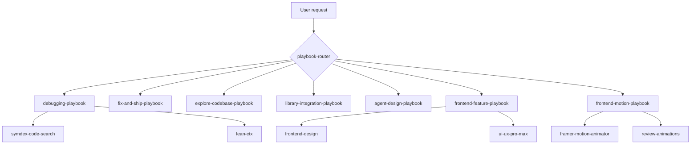

<p align="center">
  
  
  
</p>

<h1 align="center">Agent Skill Routers</h1>

<p align="center">
  <strong>Stop drowning your agent in 50 skills.</strong><br />
  Thin playbooks that route to the right workflow — debug, ship, explore, integrate libraries,<br />
  design agent systems, and build frontends with real motion.
</p>

<p align="center">
  <a href="#quick-install">Install</a> ·
  <a href="#playbooks">Playbooks</a> ·
  <a href="#frontend-stack">Frontend</a> ·
  <a href="#how-it-works">How it works</a> ·
  <a href="docs/architecture.md">Architecture</a>
</p>

---

## The problem

You installed caveman, SymDex, lean-ctx, context engineering, Context7, frontend-design, Framer Motion skills… and now the agent:

- Picks the **wrong** skill for the task
- **Reads whole files** when SymDex + lean-ctx would suffice
- Produces **generic UI** because design skills never loaded in the right order
- **Stacks** context-engineering theory on a simple null-pointer fix

**Skill routers fix routing, not intelligence.** Each playbook is ~80 lines. Child skills stay separate.

## Quick install

One command installs all playbooks globally for every agent `npx skills` supports:

```bash
npx skills add TeckTinkerere/agent-skill-routers -g --all -y --copy
```

Install recommended child skills (code + frontend bundle):

```bash
# Code intelligence
npx skills add husnainpk/SymDex yvgude/lean-ctx JuliusBrussee/caveman upstash/context7 -g --all -y --copy

# Frontend design + motion
npx skills add anthropics/skills@frontend-design \
  nextlevelbuilder/ui-ux-pro-max-skill \
  patricio0312rev/skills@framer-motion-animator \
  emilkowalski/skills@review-animations \
  lottiefiles/motion-design-skill \
  shadcn/ui@shadcn \
  wshobson/agents@tailwind-design-system \
  -g -y --copy
```

Restart your agent after install.

## Playbooks

| Playbook | Say this… | Routes to |
|----------|-----------|-----------|
| [`playbook-router`](skills/playbook-router/) | "Which approach?" / unclear task | Picks one playbook below |
| [`debugging-playbook`](skills/debugging-playbook/) | debug, trace, root cause, error | SymDex → lean-ctx → optional caveman-lite |
| [`fix-and-ship-playbook`](skills/fix-and-ship-playbook/) | fix, patch, commit, PR | Impact check → verify → caveman-commit |
| [`explore-codebase-playbook`](skills/explore-codebase-playbook/) | how does X work, architecture | SymDex maps → lean-ctx narrow reads |
| [`library-integration-playbook`](skills/library-integration-playbook/) | how do I use Prisma/Next… | Context7 docs → repo patterns |
| [`agent-design-playbook`](skills/agent-design-playbook/) | multi-agent, harness, eval | Context engineering skills by sub-task |
| [`frontend-feature-playbook`](skills/frontend-feature-playbook/) | build UI, page, redesign | Design → UX → Tailwind → shadcn |
| [`frontend-motion-playbook`](skills/frontend-motion-playbook/) | animate, motion, Framer | Motion.dev patterns → review pass |

Full dependency list: [`skills/playbook-common/references/skill-catalog.md`](skills/playbook-common/references/skill-catalog.md)

## How it works



1. Agent matches a **situation** from the playbook `description` (YAML frontmatter).
2. Playbook lists **child skills to read** in order — not copy-paste.
3. Missing skill? Catalog has `npx skills add …` one-liners.
4. Playbook says what to **skip** (e.g. no caveman when teaching architecture).

## Frontend stack

Two playbooks split UI work so design and motion don't fight each other.

### Feature build (`frontend-feature-playbook`)

| Child skill | Source | Role |
|-------------|--------|------|
| `frontend-design` | [anthropics/skills](https://skills.sh/anthropics/skills/frontend-design) | Distinctive visual direction |
| `ui-ux-pro-max` | [nextlevelbuilder](https://skills.sh/nextlevelbuilder/ui-ux-pro-max-skill/ui-ux-pro-max) | UX + accessibility patterns |
| `tailwind-design-system` | [wshobson/agents](https://skills.sh/wshobson/agents/tailwind-design-system) | Token scale, responsive layout |
| `shadcn` | [shadcn/ui](https://skills.sh/shadcn/ui/shadcn) | Component primitives |

### Motion polish (`frontend-motion-playbook`)

| Child skill | Source | Role |
|-------------|--------|------|
| `framer-motion-animator` | [patricio0312rev/skills](https://skills.sh/patricio0312rev/skills/framer-motion-animator) | React + Motion.dev / Framer Motion |
| `review-animations` | [emilkowalski/skills](https://skills.sh/emilkowalski/skills/review-animations) | Pre-ship motion critique |
| `motion-design` | [lottiefiles](https://skills.sh/lottiefiles/motion-design-skill/motion-design) | Animation principles |
| `ui-animation` | [mblode/agent-skills](https://skills.sh/mblode/agent-skills/ui-animation) | CSS / cross-framework motion |

> **Motion.dev** users: `framer-motion-animator` covers `motion` components, layout, scroll, and `useReducedMotion`. Always pair with `review-animations` before shipping.

## Example sessions

**Debug a failing API route**

```
User: "POST /api/checkout returns 500 after deploy"
→ debugging-playbook
→ symdex: find route handler + callers
→ lean-ctx: read handler signatures + error branch lines only
```

**Build a landing page**

```
User: "Create a pricing page for our devtools product"
→ frontend-feature-playbook
→ frontend-design: token system + signature element
→ shadcn + tailwind: implement
→ frontend-motion-playbook: hero stagger + scroll reveal
→ review-animations: timing pass
```

**Integrate Framer Motion in existing app**

```
User: "Add page transitions with Framer Motion"
→ library-integration-playbook (Context7 for current API)
→ frontend-motion-playbook (implementation + reduced motion)
```

## Compatible agents

Installs via [skills.sh](https://skills.sh) to **70+ agents**, including:

Cursor · Claude Code · Codex · Kiro · OpenCode · Windsurf · Copilot · Gemini CLI · Cline · Roo · Continue · and more.

Open Plugins manifest: [`.plugin/plugin.json`](.plugin/plugin.json)

## Repository layout

```
agent-skill-routers/
├── skills/
│   ├── playbook-router/          # Meta: pick a situation
│   ├── playbook-common/          # Skill catalog + resolution rules
│   ├── debugging-playbook/
│   ├── fix-and-ship-playbook/
│   ├── explore-codebase-playbook/
│   ├── library-integration-playbook/
│   ├── agent-design-playbook/
│   ├── frontend-feature-playbook/
│   └── frontend-motion-playbook/
├── docs/architecture.md
└── README.md
```

## Contributing

1. Fork the repo
2. Add or edit a playbook under `skills/`
3. Update `skill-catalog.md` and `playbook-router` decision tree
4. Open a PR

Playbooks should stay **under 150 lines**. No megaskills.

## Author

**[TeckTinkerere](https://github.com/TeckTinkerere)**

Built for developers running multiple AI agents with large skill libraries who want **situation-aware routing** without maintaining a monolithic prompt.

## License

MIT — see [LICENSE](LICENSE).

---

<p align="center">
  <sub>If this saves you context window sanity, star the repo ⭐</sub>
</p>
