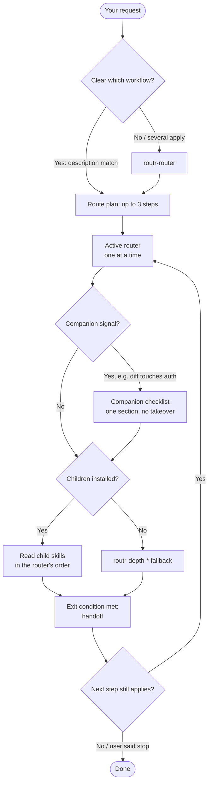

<pre align="center">
██████╗  ██████╗ ██╗   ██╗████████╗██████╗ 
██╔══██╗██╔═══██╗██║   ██║╚══██╔══╝██╔══██╗
██████╔╝██║   ██║██║   ██║   ██║   ██████╔╝
██╔══██╗██║   ██║██║   ██║   ██║   ██╔══██╗
██║  ██║╚██████╔╝╚██████╔╝   ██║   ██║  ██║
╚═╝  ╚═╝ ╚═════╝  ╚═════╝    ╚═╝   ╚═╝  ╚═╝
</pre>

<p align="center">
  <strong>Situational routers for AI coding agents</strong><br />
  <sub>Your agent picks the right skill, in the right order, before it burns your context window.</sub>
</p>

<p align="center">
  <a href="https://github.com/TeckTinkerere/ROUTR/actions/workflows/validate-skills.yml"></a>
  
  
  
</p>

<p align="center">
  <a href="#quickstart"><b>Quickstart</b></a> ·
  <a href="#how-routing-works">How it works</a> ·
  <a href="#multi-route-plans">Multi-route plans</a> ·
  <a href="#measured-routing-quality">Quality</a> ·
  <a href="#all-routers">All routers</a> ·
  <a href="INSTALL.md">Install</a> ·
  <a href="CONTRIBUTING.md">Contribute</a>
</p>

---

You installed dozens of skills. The agent picks the wrong one, reads whole files, and burns context. ROUTR fixes that with small `routr-*` router skills that match a **situation** and tell the agent what to read, in what order, and what to skip.

- **Right skill, first time.** Each router has a tight `Use when:` / `Not for:` description, so the agent chooses from the slash-menu text alone.
- **Whole route, announced upfront.** Real requests span several routers ("fix the 500 and ship it"). ROUTR plans up to three steps, with one router active at a time.
- **Measured, not guessed.** 153 eval prompts, a validator in CI, and blind model runs that reach 97 to 99% router accuracy. You can reproduce every number.

> Routers route. Install **child skill bundles** for full depth, see the [skill registry](skills/routr-catalog/references/skill-registry.md). Missing children fall back to built-in `routr-depth-*` skills.

## Quickstart

About 30 seconds, Node.js 18+ required:

```bash
# Interactive checkbox picker
npx skills add TeckTinkerere/ROUTR -g --copy

# Or every routr-* skill, no prompts
npx skills add TeckTinkerere/ROUTR -g --all -y --copy
```

Restart your agent, then type `/routr-` in the slash menu. Try:

> *"Fix the 500 on checkout and ship it"*

You should see a route plan like `routr-debug → routr-ship`. Windows, per-agent paths, bundles and troubleshooting are in **[INSTALL.md](INSTALL.md)**.

**v2 breaking rename:** `*-playbook` became `routr-*`. See [docs/naming.md](docs/naming.md).

---

## How routing works


```mermaid
flowchart TD
    A([Your request]) --> B{Clear which workflow?}
    B -- "No / several apply" --> R[routr-router]
    B -- "Yes: description match" --> P
    R --> P[Route plan: up to 3 steps]
    P --> X[Active router<br/>one at a time]
    X --> C{Companion signal?}
    C -- "Yes, e.g. diff touches auth" --> K[Companion checklist<br/>one section, no takeover]
    C -- No --> D
    K --> D{Children installed?}
    D -- Yes --> E[Read child skills<br/>in the router's order]
    D -- No --> F[routr-depth-* fallback]
    E --> H[Exit condition met:<br/>handoff]
    F --> H
    H --> N{Next step still applies?}
    N -- Yes --> X
    N -- "No / user said stop" --> Z([Done])
```

1. The agent matches a router by its `description` (the text you see on slash-menu hover), or asks `routr-router` when the request is unclear.
2. The router announces a **route plan**, then works its first step. Only one router is active at a time.
3. A **companion** may add one checklist section on a named signal. It never takes over.
4. The router tells the agent which **child skills** to read, and falls back to `routr-depth-*` if they are missing.
5. At the exit condition the router **hands off**. The agent re-checks the plan and drops steps that no longer apply.

The machine-readable source of truth for handoffs, companions and chains is [`routes.json`](skills/routr-catalog/references/routes.json). Design notes live in [docs/architecture.md](docs/architecture.md) and [docs/plans/](docs/plans/).

---

## Multi-route plans

The iron law stays: **one router active at a time.** What changes is that the agent plans the whole route before starting.

```
ROUTR plan: routr-debug → routr-ship → routr-deploy
Now: routr-debug — 500 on checkout, root cause unknown
Next: routr-ship once root cause is fixed and verified
```

- A plan has **at most 3 steps**. Anything longer goes to `routr-plan` first.
- Each step has an **exit condition**: the point where the agent hands off and re-routes.
- You can steer mid-task: "skip", "stop after debug", "just ship".
- At each handoff the agent checks the next step still applies, and drops it if not.

### Companions

A companion contributes **one checklist section** to the active router without taking over. At most one per step, and only on a named signal:

| Active | Companion | Signal |
|--------|-----------|--------|
| `routr-ship` | `routr-security` | diff touches auth, sessions, RLS, secrets, payments |
| `routr-frontend` | `routr-perf` | stated perf budget, LCP/INP complaint, heavy media |
| `routr-ai` | `routr-agents` | output-quality scoring or an eval harness |
| `routr-database` | `routr-security` | RLS policies, grants, multi-tenant data |
| `routr-deploy` | `routr-qa` | you ask to verify the deployed preview |
| `routr-mobile` | `routr-perf` | jank, slow startup, list performance |

A companion reads only the section its `routes.json` entry names. It never runs bootstrap and never loads its own children.

### Tie-break: the domain beats generic debug

If the **domain's own machinery** is failing (a render pipeline, an agent loop, an AI SDK stream, an EAS build, a migration runner), the domain router owns it. It hands to `routr-debug` only if the root cause is outside the domain. If the failure is in **application logic** that merely uses the domain (a query returning the wrong rows), it goes to `routr-debug`.

### Chain evals

Evals support `acceptable_routers` and `acceptable_chains` for prompts with more than one right answer, and score route plans as well as single routers: router accuracy, chain exact-match, and chain prefix-match (the plan starts with the expected first two steps).

---

## Measured routing quality

Routing is tested, not assumed. Blind runs used a **Haiku 4.5** subagent that could read only the exported prompt file and menu, with no expected answers.

| Eval set | Router accuracy | Chain exact / prefix | `must_not_load` violations |
|----------|-----------------|----------------------|----------------------------|
| Single-router, 153 prompts (run A / B) | 99.3% / 97.4% | — | 0 / 0 |
| With multi-route, 176 prompts (run A / B) | 98.3% / 97.7% | 75.0% / 75.0%, 82.1% / 78.6% | 1 / 1 |
| Same, with `next` and `companions` in the menu (run C / D) | 94.3% / 98.9% | 75.0% / 78.6%, 78.6% / 78.6% | 4 / 0 |

**Plan composition rules (unreleased):** these runs used 24 held-out chain prompts, written before the rules and never used for tuning.

| Held-out chain set, 24 prompts | Router accuracy | Chain exact-match | Violations |
|--------------------------------|-----------------|-------------------|------------|
| Before: menu with handoffs only (2 runs) | 83.3% / 87.5% | 75.0% / 75.0% | 0 / 0 |
| After: plus `composition_rules`, `step_signals` and known plans (2 runs) | **95.8% / 95.8%** | **91.7% / 91.7%** | 0 / 0 |

On the 28 tuned chain prompts, chain exact-match moved from 85.7% / 82.1% to 85.7% / 92.9%.

- **176 prompts** across **21 eval files**, covering every situational router with adversarial boundary pairs, plus 20 multi-intent prompts in `evals/multi-route.eval.json` (20/20 router accuracy in both runs).
- Handoff lists alone barely moved chain scores. Explicit composition rules did, and the gain held on prompts the rules were never tuned on. To reproduce the comparison, run `--export-prompts` with and without `--no-route-guide`.
- Single runs vary by about ±3 points, so compare averages. The offline static mode is only a lexical smoke test and is not a quality claim.
- Details: [docs/plans/2026-09-25-routr-v2.1.md](docs/plans/2026-09-25-routr-v2.1.md) and [docs/plans/2026-10-09-multi-route.md](docs/plans/2026-10-09-multi-route.md).
- One caveat: a single small model on one benchmark you can read. Your agent, model and prompts will differ. That is what [misroute reports](https://github.com/TeckTinkerere/ROUTR/issues/new?template=misroute.yml) are for.

**Reproduce it:**

```bash
bash scripts/validate-skills.sh                         # mechanical checks
python scripts/run-evals.py                             # offline static baseline

# Blind model eval, no CLI needed
python scripts/run-evals.py --export-prompts prompts.json
# give prompts.json to a model; it returns {"<id>": "routr-xxx", ...} as preds.json
python scripts/run-evals.py --mode predictions --predictions preds.json

# Or, with the Claude CLI signed in
python scripts/run-evals.py --mode claude --model claude-haiku-4-5-20251001
```

---

## Slash menu

Hover text = YAML `description` in each `SKILL.md`:

| Router | Hover |
|--------|-------|
| `routr-router` | Pick workflow when unclear |
| `routr-debug` | Find and fix bugs step by step |
| `routr-ship` | Fix, verify, commit or PR |
| `routr-frontend` | Build or redesign UI |
| `routr-motion` | Animate existing UI |
| `routr-plan` | Plan, PRD, grill ideas |
| `routr-video` | Video — launch, product marketing, data-driven, Remotion, HyperFrames |
| `routr-ai` | AI SDK chat, agents, RAG |
| `routr-mobile` | Expo / React Native |
| `routr-marketing` | SEO, copy, growth |
| `routr-perf` | Core Web Vitals, bundle size, re-renders, N+1, leaks, caching |
| … | [Full list in INSTALL.md](INSTALL.md) |

---

## Stacks

### Mobile · Expo / React Native

| Router | Child skills |
|--------|--------------|
| [`routr-mobile`](skills/routr-mobile/) | `building-native-ui`, `vercel-react-native-skills`, `native-data-fetching` |

**Say:** *"Build an Expo tab screen"* → `routr-mobile`

### Marketing & SEO

| Router | Child skills |
|--------|--------------|
| [`routr-marketing`](skills/routr-marketing/) | `seo-audit`, `copywriting`, `ai-seo`, `aso` |

**Say:** *"Audit SEO and rewrite landing copy"* → `routr-marketing` → `routr-frontend`

### AI / LLM apps

| Router | Child skills |
|--------|--------------|
| [`routr-ai`](skills/routr-ai/) | `ai-sdk`, `find-docs` |

Multi-agent architecture → `routr-agents`

### Video · brag, HyperFrames, Remotion

| Router | Child skills |
|--------|--------------|
| [`routr-video`](skills/routr-video/) | `brag`, `remotion-best-practices`, `hyperframes`, `media-use` |

Single entry — `references/launch.md` and `references/remotion.md` for sub-paths.

**Say:** *"/brag about this project"* → `routr-video` → `brag`

---

## All routers

<details>
<summary><b>Core engineering (14)</b></summary>

| Router | Triggers | Top children |
|--------|----------|--------------|
| [`routr-plan`](skills/routr-plan/) | plan, PRD, grill | `brainstorming`, `grill-me`, `to-prd` |
| [`routr-debug`](skills/routr-debug/) | debug, error | `systematic-debugging`, symdex, lean-ctx |
| [`routr-ship`](skills/routr-ship/) | fix, commit, PR | TDD, `caveman-commit` |
| [`routr-test`](skills/routr-test/) | tests, Playwright | `webapp-testing`, `tdd` |
| [`routr-review`](skills/routr-review/) | review PR | `requesting-code-review` |
| [`routr-refactor`](skills/routr-refactor/) | refactor | `improve-codebase-architecture` |
| [`routr-deploy`](skills/routr-deploy/) | deploy, Vercel | `deploy-to-vercel` |
| [`routr-database`](skills/routr-database/) | SQL, Supabase | `supabase-postgres-best-practices` |
| [`routr-qa`](skills/routr-qa/) | browser QA | `agent-browser` |
| [`routr-security`](skills/routr-security/) | security audit | `semgrep` |
| [`routr-perf`](skills/routr-perf/) | slow page, bundle, N+1, leaks | `vercel-react-best-practices`, `webapp-testing` |
| [`routr-explore`](skills/routr-explore/) | how does X work | symdex → lean-ctx |
| [`routr-integrate`](skills/routr-integrate/) | library API | `find-docs` |
| [`routr-agents`](skills/routr-agents/) | agent systems | context-engineering bundle |

</details>

<details>
<summary><b>Product surfaces (6)</b></summary>

| Router | Triggers | Top children |
|--------|----------|--------------|
| [`routr-frontend`](skills/routr-frontend/) | build UI | `frontend-design` |
| [`routr-motion`](skills/routr-motion/) | animate | `framer-motion-animator` |
| [`routr-mobile`](skills/routr-mobile/) | Expo, RN | `building-native-ui` |
| [`routr-marketing`](skills/routr-marketing/) | SEO, copy | `seo-audit`, `copywriting` |
| [`routr-ai`](skills/routr-ai/) | chatbot, AI SDK | `ai-sdk` |
| [`routr-video`](skills/routr-video/) | video, /brag, promo, captions | `brag`, `remotion-best-practices`, `media-use` |

</details>

<details>
<summary><b>Meta + depth fallbacks (8)</b></summary>

| Skill | Role |
|-------|------|
| [`routr-router`](skills/routr-router/) | Pick one router when unclear |
| [`routr-catalog`](skills/routr-catalog/) | Registry, bundles, install commands |
| `routr-depth-debug` | Fallback when `systematic-debugging` missing |
| `routr-depth-frontend` | Fallback when `frontend-design` missing |
| `routr-depth-plan` | Fallback when `brainstorming` missing |
| `routr-depth-ship` | Fallback when `caveman-commit` missing |
| `routr-depth-test` | Fallback when `webapp-testing` missing |
| `routr-depth-security` | Fallback when `semgrep`/rules-auditor missing |

Old `*-playbook` folders were removed in v2 — use `routr-*`.

</details>

---

## Child bundles

| Bundle | Covers |
|--------|--------|
| `routr-bundle-core` | debug, ship, explore, symdex, lean-ctx |
| `routr-bundle-frontend` | frontend-design, Vercel UI, shadcn |
| `routr-bundle-full` | Power-user starter pack |

Install commands in [skill-registry.md](skills/routr-catalog/references/skill-registry.md).

---

## Example flows

**Ship feature + brag video**

```
routr-ship → commit
routr-video → brag
routr-marketing → share copy
```

**AI chat product**

```
routr-plan → brainstorm + PRD
routr-ai → ai-sdk
routr-frontend → chat UI
routr-marketing → ai-seo
```

---

## Quality & upkeep

- `bash scripts/validate-skills.sh` — 11 mechanical checks: frontmatter/folder match, `Use when:` and `Not for:` presence, description length budget, SKILL.md line caps, child-skill resolution, broken relative links, eval JSON validity, eval coverage, and router-tree/resolution.md registration. Runs in CI.
- `python scripts/run-evals.py` — runs every `evals/*.eval.json` prompt against the router menu. Modes: `static` (default, offline), `claude` (real `claude -p` calls), `predictions` (score answers from any model) and `--export-prompts` (write the menu and prompts for a blind run). Exits non-zero under `--min-accuracy`.
- `bash scripts/sync-installed.sh` (or `scripts/sync-installed.ps1` on Windows) — diffs this repo's `skills/routr-*` against your installed copies and reports drift. `--apply` copies; `--prune-legacy` moves removed `*-playbook` stubs to a dated backup folder instead of deleting them. See [INSTALL.md](INSTALL.md#keep-installed-copies-in-sync).

---

## Roadmap

Honest list of what is not done yet:

- **Chain scoring in CI.** Chain metrics exist in the eval runner but are report-only. No accuracy gate on them yet.
- **Per-host eval runs.** Published numbers come from one small model. We want results per agent and host (Claude Code, Cursor, Codex, others).
- **Independent `claude -p` confirmation.** `--mode claude` has not been run against the final descriptions because the local CLI was signed out.
- **More depth fallbacks.** Only debug, frontend, plan, ship, test and security have built-in fallbacks. Other routers degrade to a plain checklist when children are missing.
- **More contested-prompt handling.** Some prompts legitimately start at more than one router, or are unclear about an implied step ("add streaming chat" doesn't say whether a chat UI exists). `acceptable_routers` and `acceptable_chains` help, but coverage is thin.
- **A bigger held-out set.** 24 held-out chain prompts can only detect large changes. We want 100+, written by contributors.

Want to pick one up? See [CONTRIBUTING.md](CONTRIBUTING.md).

---

## Contributing and community

- **Agent picked the wrong router?** [Report a misroute](https://github.com/TeckTinkerere/ROUTR/issues/new?template=misroute.yml). It becomes an eval prompt.
- **Missing a situation?** [Propose a router](https://github.com/TeckTinkerere/ROUTR/issues/new?template=new-router.yml), then follow [docs/authoring.md](docs/authoring.md).
- **Questions and setups:** [Discussions](https://github.com/TeckTinkerere/ROUTR/discussions).
- **Guides:** [CONTRIBUTING.md](CONTRIBUTING.md) · [Code of Conduct](CODE_OF_CONDUCT.md) · [Security policy](SECURITY.md) · [Changelog](CHANGELOG.md)

## License

MIT, see [LICENSE](LICENSE). Made by [TeckTinkerere](https://github.com/TeckTinkerere).

<p align="center"><sub>Star ROUTR if it saved your context window</sub></p>
